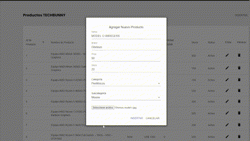

# [TECHBUNNY](https://pf-techbunny-lake.vercel.app/)

1..[Acerca de](#Acerca de)
2..[Tajetas de prueba](#TARJETAS DE PRUEBA)
3..[Landing Page](#Landing Page)
4..[Home](#Home)
5..[Login / Register](#Login / Register)
6..[Searchbar dinamica](#Searchbar dinamica)
8..[Modo oscuro , Favoritos , Carrito y Panel de usuario](#Modo oscuro , Favoritos , Carrito y Panel de usuario)
9..[Filtro por marca y Ordernamiento](#Filtro por marca y Ordernamiento)
10..[Review de producto](#Review de producto)
11..[Realizar una compra](#Realizar una compra)
12..[Informacion de orden en panel de usuario](#Informacion de orden en panel de usuario)
13..[Mail con la informacion de compra](#Mail con la informacion de compra)
14..[Cloudinary](#Cloudinary)
15..[Responsive](#Responsive)
16..[Linkedin](#Linkedin)
17..[Link a deploy](https://pf-techbunny-lake.vercel.app/)
18..[Link a video explicativo de la pagina](https://vimeo.com/795225619)

# Acerca de
[TECHBUNNY](https://pf-techbunny-lake.vercel.app/) es un ecommerce de tecnología que cuenta con un catálogo de más de 800 productos. Además, ofrecemos la posibilidad de crear una cuenta y acceder a nuestras herramientas, una pasarela de pago integrada y un panel de control con estadísticas en tiempo real para que los administradores puedan gestionar todo lo necesario.

# TARJETAS DE PRUEBA
| Tarjeta     | Número                | Código de seguridad | Fecha de caducidad | Nombre |    DNI    |
| ----------- | --------------------- | ------------------- | ------------------ | ------ | --------- |
| Mastercard  | 5031 7557 3453 0604   |        123          |       11/25        |  APRO  | 12345678  |
| Visa        | 4509 9535 6623 3704   |        123          |       11/25        |  APRO  | 12345678  |
# Landing Page

En esta página mostramos varias imágenes relacionadas con los productos que vendemos. Al presionar el botón de 'Ingresar', serás redirigido al inicio del sitio. Además, si presionas la flecha hacia abajo, podrás conocer al equipo que está detrás de TECHBUNNY.

# Home

En la página de inicio encontrarás dos carruseles con diferentes productos, dependiendo de si el usuario ha iniciado sesión o no. Si no hay usuario logueado, los productos se mostrarán de manera aleatoria. 
Además, podrás encontrar las 6 categorías y las 6 marcas más populares del sitio.

# Login / Register

Para registrarte, tienes la opción clásica de rellenar el formulario, o también puedes hacerlo mediante Google. Y para el login, lo mismo: si tienes una cuenta tradicional, la utilizas; sino, puedes ingresar con Google. 
Si te registras de la manera tradicional, recibirás un correo electrónico para confirmar tu cuenta.

# Searchbar dinamica

La barra de búsqueda es uno de los componentes que se incluyen en la barra de navegación.
La misma se actualiza automáticamente a medida que escribes.

# Modo oscuro , Favoritos , Carrito y Panel de usuario

En la barra de navegación encontrarás un menú desplegable con todas las categorías existentes, un botón para cambiar al modo oscuro/claro, un botón para acceder a favoritos, un botón para acceder al carrito de compras y un menú desplegable con el panel de usuario. Desde este último, podrás acceder a tu perfil y, si eres administrador, al panel de control.

# Detalles del panel de usuario

En el panel de usuario podrás visualizar las órdenes que has realizado y su estado. 
Además, si eres administrador, podrás acceder al panel de control, donde encontrarás datos reales de miles de compras simuladas por nosotros.

# Filtro por marca y Ordernamiento 

Cuando accedes a una categoría, como por ejemplo "notebooks", tendrás la opción de filtrar por marca y también ordenar por valor (ascendente o descendente), ambos funcionando simultáneamente.

# Review de producto

En los productos, puedes dejar una reseña que se promedia con las existentes y así se le da un puntaje al producto en una escala de 1 a 5 estrellas.

# Realizar una compra

Al confirmar datos de la compra se abre un popup de mercado pago para realizar el pago

En la parte superior de este Read me se encuentran las tarjetas de prueba para realizar compras.

Una vez completada la compra en nuestro perfil podemos ver la orden completada y recibiremos un mail 
# Informacion de orden en panel de usuario

En el panel de usuario ahora veras tu nueva orden y el status de la misma.

# Mail con la informacion de compra 

Recibiras un mail a la direccion que especificaste antes de confirmar la compra . 

# Cloudinary

Utilizamos Cloudinary para subir las 830 imágenes correspondientes a cada uno de los productos de la página. 
Además, también se pueden subir nuevas imágenes si se agregan nuevos productos, las cuales se suben automáticamente a la misma cuenta de Cloudinary que ya se utiliza.

Se puede definir nuevo producto , definiendo nombre , precio , stock , categoria y marca , si la categoria o la marca no existe esta se crea. 

Y ahora el producto va a aparecer en la pagina como cualquier otro.

# Responsive

 Nuestra página web está diseñada para ser totalmente responsiva a formatos móviles. Esto significa que podrás disfrutar de una experiencia de navegación óptima desde cualquier dispositivo móvil, sin importar su tamaño o resolución de pantalla. 
Todos los elementos de la página, incluyendo imágenes, texto y botones, están adaptados para garantizar una visualización clara y precisa en cualquier dispositivo.

# Linkedin

# [Link a deploy](https://pf-techbunny-lake.vercel.app/)
# [Link a video  explicativo de la pagina](https://vimeo.com/795225619)
